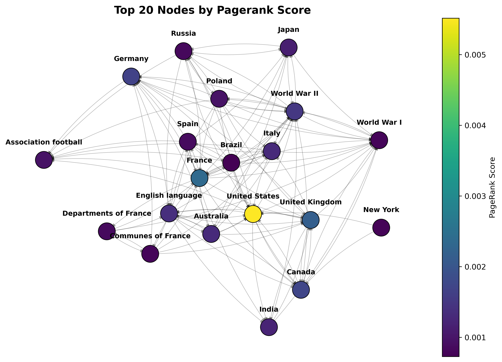
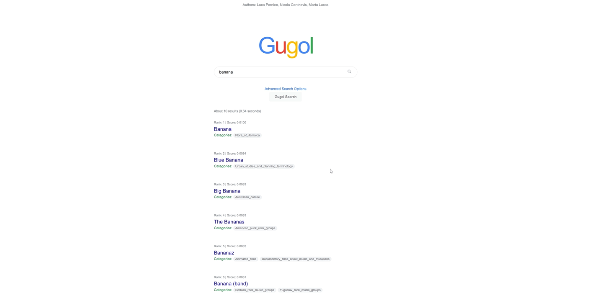

# Information Retrieval final project: PageRank
This repository contains the implementation of the PageRank algorithm on the wikipedia top categories dataset, freely available at: https://snap.stanford.edu/data/wiki-topcats.html .

### Requirements
All requirements are listed in the `requirements.txt` file. Or if you prefer, you can create a conda environment using the provided `conda.yml` file.

### Dataset
The [Wikipedia top categories dataset](https://snap.stanford.edu/data/wiki-topcats.html) is a web graph of Wikipedia hyperlinks, collected in September 2011 by the Stanford Network Analysis Project (SNAP). The network was constructed by first taking the largest strongly connected component of Wikipedia, then restricting to pages in the top set of categories (those with at least 100 pages), and finally taking the largest strongly connected component of the restricted graph.
In addition to the graph, also the **page names** and **categories** of the articles are provided.

The three files can be directly downloaded using the `utils.py` script, which will download them in the `data/` folder.
Make sure all files are present, before running the other scripts: `wiki-topcats.txt`, `wiki-topcats-page-names.txt`, and `wiki-topcats-categories.txt`.
### PageRank
We implemented the Pagerank algorithm, leveraging two different data structures: an adjacency list and an adjacency matrix. 
You can choose which of these two methods to use by setting the `method` variable in the `PageRank.py` file to either `list` or `matrix`.
The main difference is that for the `matrix` method we leveraged the Python  [GraphBLAS](https://graphblas.org/) library (a Python wrapper for the C API).  This allows for parallel computation, leading to a significant speedup in the computation of the PageRank scores.

### Visualizations
We also added some visualizations of the web graph, colored by the corresponding PageRank score.

You can choose which visualization to display by modifying `main` in the  `Viz.py` file, and choosing a category of interest by browsing the ones [available.](data/wiki-topcats-categories.txt)

To avoid too much clutter we plotted only a small subset of the nodes, and also analyzed results for topic specific and personalized PageRank on different categories.

The following visualization represents the top 20 nodes according to the PageRank score, colored by the respective score. 

### Gugol Interface
We also implemented a simple interface to perform queries on our WebGraph. 
This interface is called "gugol" and is built using [FastAPI](https://fastapi.tiangolo.com/). It allows users to perform queries on the web graph and retrieve results based on PageRank scores.

To run the "gugol" interface, first run `PageRank.py` and the notebook `embedder.py`; otherwise, the necessary files will not be generated.
Then, run the command `fastapi run gugol_main.py`. The default port should be 8000.
For more instructions on changing the port if necessary, refer to the FastAPI documentation available online.
*Note*: The "gugol" interface is intended for the project presentation only. We do not expect others to run it, so we will not provide further documentation on how to use this interface.

### Authors
- [Nicola Cortinovis](https://github.com/nicolacortinovis)
- [Marta Lucas](https://github.com/15Max)
- [Luca Pernice](https://github.com/lucapernice)

For an overview of our project, you can checkout our [presentation slides](materials/PageRankPresentation.pdf).
### References 
- [Page, L., Brin, S., Motwani, R. and Winograd, T., The PageRank 
Citation Ranking: Bringing Order to the Web, Stanford InfoLab, 1999](materials/Pagerank.pdf)
- [Brin, S. and Page, L., The anatomy of a large-scale hypertextual Web search engine, Computer networks and ISDN systems, 30(1-7), pp.107-117, 1998
](materials/Brin98Anatomy.pdf)
